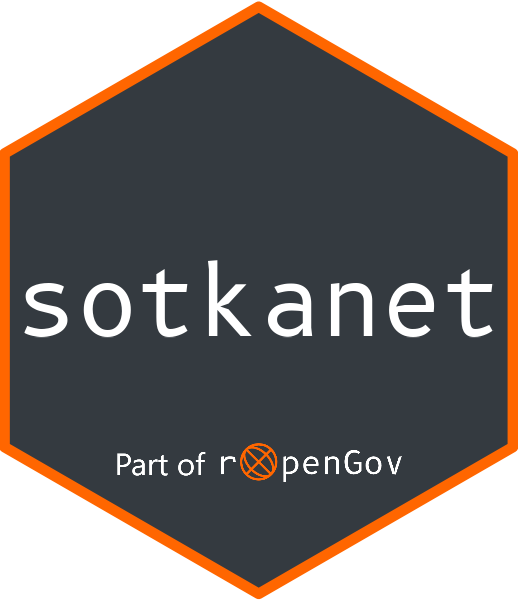

<!-- README.md is generated from README.Rmd. Please edit that file -->

sotkanet: Tools for accessing open data on welfare and health in Finland 
========================================================================================================================================================================================

<!-- badges: start -->

<!-- badges: end -->

R package to access and manipulate data from the Sotkanet demographics
indicator database. The [Sotkanet data
portal](https://sotkanet.fi/sotkanet/fi/index) provides over 2000
demographic indicators across Finland and Europe, and is maintained by
the [National Institute for Health and Welfare
(THL)](https://thl.fi/fi/). For more information, see [data
description](https://sotkanet.fi/sotkanet/en/data).

### Installation

You can install the stable release version from CRAN:

    install.packages("sotkanet")

Alternatively, you can install the development version of sotkanet
package from GitHub with:

    # install.packages("remotes")
    remotes::install_github("rOpenGov/sotkanet")

### Using the package

Load the package in R:

    library(sotkanet)

List available indicators in the Sotkanet data portal:

    # Pre-defined list of indicators to save bandwidth
    sotkanet.indicators <- SotkanetIndicators(c(4,5,6,7,46,74))
    head(sotkanet.indicators$indicator.title.fi)
    #> [1] "Mielenterveyden häiriöihin sairaalahoitoa saaneet 0 - 17-vuotiaat / 1 000 vastaavanikäistä"             
    #> [2] "Toimeentulotukea saaneet 25 - 64-vuotiaat, % vastaavanikäisestä väestöstä"                              
    #> [3] "Somaattisen erikoissairaanhoidon vuodeosastohoitopäivät 75 vuotta täyttäneillä / 1 000 vastaavanikäistä"
    #> [4] "0 - 6-vuotiaat, % väestöstä"                                                                            
    #> [5] "0 - 6-vuotiaat, % väestöstä, väestöennuste 2060"                                                        
    #> [6] "Yhden vanhemman perheet, % lapsiperheistä"

Here is an example of data retrieval and visualization, using indicator
describing private dental care use among 0-17 years old in 2015-2020.

    library(ggplot2)
    library(ggrepel)

    hammashoito <- GetDataSotkanet(indicators = 1075, years = 2015:2020, genders = "total", region.category = "MAAKUNTA")

    # Indicator title tells what this indicator is about
    unique(hammashoito$indicator.title.fi)
    #> [1] "Yksityisen hammashuollon käynnit 0 - 17-vuotiailla / 1 000 vastaavanikäistä"

    # Some data has to be retrieved separately
    hammashoito_metadata <- SotkanetIndicatorMetadata(id = 1075)

    plot_caption <- paste0("Lähde: https://sotkanet.fi / ", hammashoito_metadata$organization$title$fi, "\n",
                           "Datan päiväys ", hammashoito_metadata$`data-updated`)

    plot <- ggplot(hammashoito, aes(x=year, y=primary.value, group=region.title.fi))+
      geom_line(aes(color=region.title.fi)) +
      geom_point(aes(color=region.title.fi))

    plot + labs(title = "Yksityisen hammashuollon käynnit 2015-2020",
                subtitle = "0 - 17-vuotiailla / 1 000 vastaavanikäistä",
                x = "Vuosi", 
                y = "Käyntien lkm",
                caption = plot_caption,
                color = "Maakunta") +
      geom_text_repel(
        aes(color = region.title.fi, label = ifelse(year == 2020, region.title.fi, NA_character_)),
        xlim = c(2021, 2023),
        direction = "both",
        hjust = 0,
        segment.size = .7,
        segment.alpha = .5,
        segment.linetype = "dotted",
        box.padding = .4,
        segment.curvature = -0.1,
        segment.ncp = 3,
        segment.angle = 20) +
      theme(legend.position = "none",
            panel.background = element_rect(fill = "linen")) +
      scale_x_continuous(
        expand = c(0, 0),
        limits = c(2015, 2022), 
        breaks = seq(2015, 2020))
    #> Warning: Removed 95 rows containing missing values (geom_text_repel).
    #> Warning: ggrepel: 2 unlabeled data points (too many overlaps). Consider
    #> increasing max.overlaps
    #> Warning in grid.Call.graphics(C_xspline, x$x, x$y, x$shape, x$open, x$arrow, :
    #> semi-transparency is not supported on this device: reported only once per page

For more in-depth examples, see the package vignette or online [tutorial
page](http://ropengov.github.io/sotkanet/articles/tutorial.html).

### Contributing

-   [Submit suggestions and bug
    reports](https://github.com/ropengov/sotkanet/issues) (provide the
    output of `sessionInfo()` and `packageVersion("sotkanet")` and
    preferably provide a [reproducible
    example](http://adv-r.had.co.nz/Reproducibility.html))
-   [Send a pull request](https://github.com/ropengov/sotkanet/pulls)
-   [Star us on the Github page](https://github.com/ropengov/sotkanet/)
-   [See our website](http://ropengov.org/community/) for additional
    contact information

### Acknowledgements

**Kindly cite this work** as follows: [Leo
Lahti](https://github.com/antagomir), Einari Happonen, Juuso Parkkinen,
Joona Lehtomaki, Vesa Saaristo and Pyry Kantanen (rOpenGov 2022).
sotkanet: Sotkanet Open Data Access and Analysis. R package version
0.9.77. URL:
<a href="https://github.com/rOpenGov/sotkanet" class="uri">https://github.com/rOpenGov/sotkanet</a>

We are grateful to all
[contributors](https://github.com/ropengov/sotkanet/graphs/contributors),
and for the [Sotkanet](https://sotkanet.fi/sotkanet/en/index?)
Statistics and Indicator Bank! This project is part of
[rOpenGov](http://ropengov.org).

### Disclaimer

This package is in no way officially related to or endorsed by The
Finnish Institute for Health and Welfare (Terveyden ja hyvinvoinnin
laitos, THL).

For information about THL’s open data license and limitation of
liability, please see their website:

-   In English: [THL’s open data license and limitation of
    liability](https://yhteistyotilat.fi/wiki08/display/THLKA/THL%27s+open+data+license+and+limitation+of+liability)
-   In Finnish: [THL:n avoimen datan lisenssi ja
    vastuuvapauslauseke](https://yhteistyotilat.fi/wiki08/display/THLKA/THL%3An+avoimen+datan+lisenssi+ja+vastuuvapauslauseke)
