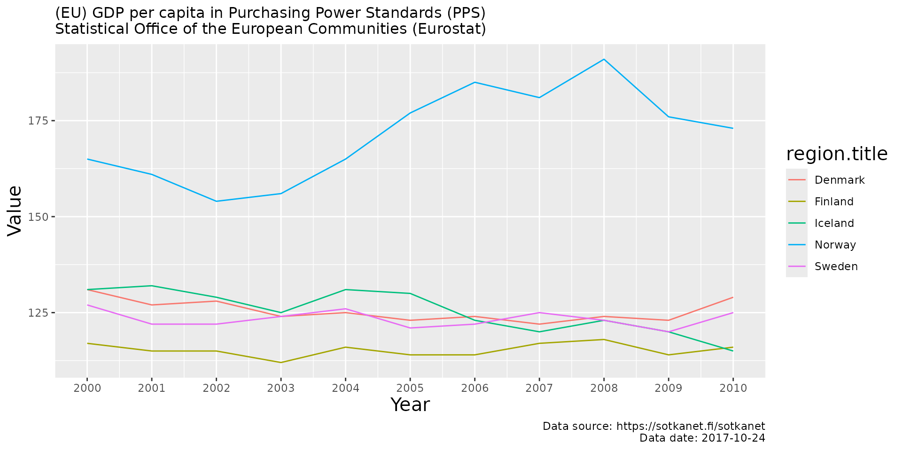
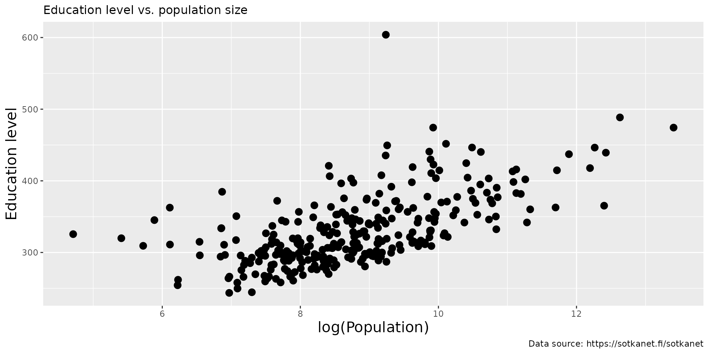

# Sotkanet API R tools

This [sotkanet](https://github.com/rOpenGov/sotkanet) R package provides
access to data from the [Sotkanet
portal](https://sotkanet.fi/sotkanet/en/index). Your
[contributions](https://ropengov.org/community/) and [bug reports and
other feedback](https://github.com/rOpenGov/sotkanet) are welcome.

## Introduction

The Sotkanet portal provides over 2000 demographic indicators across
Finland and Europe. It is maintained by the National Institute for
Health and Welfare (THL). For more information, see [Information about
Sotkanet](https://sotkanet.fi/sotkanet/en/tietoa-palvelusta) and [API
description](https://sotkanet.fi/sotkanet/en/ohje/74).

The `sotkanet` R package enables access to the Sotkanet API using R
facilitating the use of the data from the API. This package is part of
[rOpenGov](https://ropengov.org).

## Installation

To install latest release version from CRAN, use:

``` r
install.packages("sotkanet")
```

To install development version from GitHub, use:

``` r
library(remotes)
remotes::install_github("ropengov/sotkanet")
```

Test the installation by loading the package:

``` r
library(sotkanet)
```

## Usage

### Listing availabe indicators

Load sotkanet and other packages used in the vignette.

``` r
library(sotkanet)
library(kableExtra)
library(ggplot2)
```

List available Sotkanet indicators using
[`sotkanet_indicators()`](https://ropengov.github.io/sotkanet/reference/sotkanet_indicators.md):

``` r
# Using a preset list of indicators to avoid a large download
indicators <- sotkanet_indicators(id = c(4, 5, 6, 127, 10012, 10027),
                                  type = "table", lang = "en")
kable(head(indicators))
```

| indicator | indicator.title                                                                                              | indicator.organization | indicator.organization.title                              |
|----------:|:-------------------------------------------------------------------------------------------------------------|-----------------------:|:----------------------------------------------------------|
|         4 | Hospital care for mental disorders, recipients aged 0-17 per 1000 persons of the same age                    |                      2 | Finnish institute for Health and Welfare (THL)            |
|         5 | Social assistance recipients aged 25-64, as % of total population of same age                                |                      2 | Finnish institute for Health and Welfare (THL)            |
|         6 | Specialised somatic inpatient health care, care days for those aged 75 and over per 1000 persons of same age |                      2 | Finnish institute for Health and Welfare (THL)            |
|       127 | Population at year end                                                                                       |                      3 | Statistics Finland                                        |
|     10012 | (EU) GDP per capita in Purchasing Power Standards (PPS)                                                      |                     58 | Statistical Office of the European Communities (Eurostat) |
|     10027 | (EU) Standardised death rate due to suicides per 100 000 persons                                             |                     58 | Statistical Office of the European Communities (Eurostat) |

List geographical regions with available indicators using
[`sotkanet_regions()`](https://ropengov.github.io/sotkanet/reference/sotkanet_regions.md):

``` r
# List of the first few regions
regions <- sotkanet_regions(type = "table", lang = "en")
kable(head(regions))
```

| region | region.title                            | region.code | region.category     | region.uri                           |
|-------:|:----------------------------------------|:------------|:--------------------|:-------------------------------------|
|    833 | Area for Southern Finland AVI           | 1           | ALUEHALLINTOVIRASTO | <http://www.yso.fi/onto/kunnat/ahv1> |
|    834 | Area for Southwestern Finland AVI       | 2           | ALUEHALLINTOVIRASTO | <http://www.yso.fi/onto/kunnat/ahv2> |
|    835 | Area for Eastern Finland AVI            | 3           | ALUEHALLINTOVIRASTO | <http://www.yso.fi/onto/kunnat/ahv3> |
|    836 | Area for Western and Inland Finland AVI | 4           | ALUEHALLINTOVIRASTO | <http://www.yso.fi/onto/kunnat/ahv4> |
|    837 | Area for Northern Finland AVI           | 5           | ALUEHALLINTOVIRASTO | <http://www.yso.fi/onto/kunnat/ahv5> |
|    838 | Area for Lapland AVI                    | 6           | ALUEHALLINTOVIRASTO | <http://www.yso.fi/onto/kunnat/ahv6> |

### Querying Sotkanet data

To download the data, we need to know the indicator for it. You can look
for the right indicator using aforementioned
[`sotkanet_indicators()`](https://ropengov.github.io/sotkanet/reference/sotkanet_indicators.md)
or by browsing the [Sotkanet
website](https://sotkanet.fi/sotkanet/en/index). For example, the
indicator no. 10012 responds to the (EU) GPD per capita in Purchasing
Power Standards (PPS) dataset. The data can be downloaded with
[`get_sotkanet()`](https://ropengov.github.io/sotkanet/reference/get_sotkanet.md)
function. If we want, for example, the GPD data from Finland for
2000-2010, the function call is:

``` r
# Get the indicator data
dat <- get_sotkanet(indicators = 10012, years = 2000:2010,
                    genders = c("total"), lang = "en", regions = "Finland")

# The first few lines of the data
kable(head(dat)) %>%
  kable_styling() %>%
  scroll_box(width = "100%")
```

| indicator | region | year | gender | primary.value | absolute.value | indicator.title                                         | region.title | region.code | region.category | indicator.organization.title                              |
|----------:|-------:|-----:|:-------|--------------:|:---------------|:--------------------------------------------------------|:-------------|:------------|:----------------|:----------------------------------------------------------|
|     10012 |   1045 | 2005 | total  |           114 | NA             | (EU) GDP per capita in Purchasing Power Standards (PPS) | Finland      | 246         | POHJOISMAAT     | Statistical Office of the European Communities (Eurostat) |
|     10012 |   1022 | 2010 | total  |           116 | NA             | (EU) GDP per capita in Purchasing Power Standards (PPS) | Finland      | 246         | EUROOPPA        | Statistical Office of the European Communities (Eurostat) |
|     10012 |   1022 | 2002 | total  |           115 | NA             | (EU) GDP per capita in Purchasing Power Standards (PPS) | Finland      | 246         | EUROOPPA        | Statistical Office of the European Communities (Eurostat) |
|     10012 |   1045 | 2006 | total  |           114 | NA             | (EU) GDP per capita in Purchasing Power Standards (PPS) | Finland      | 246         | POHJOISMAAT     | Statistical Office of the European Communities (Eurostat) |
|     10012 |   1022 | 2001 | total  |           115 | NA             | (EU) GDP per capita in Purchasing Power Standards (PPS) | Finland      | 246         | EUROOPPA        | Statistical Office of the European Communities (Eurostat) |
|     10012 |   1045 | 2003 | total  |           112 | NA             | (EU) GDP per capita in Purchasing Power Standards (PPS) | Finland      | 246         | POHJOISMAAT     | Statistical Office of the European Communities (Eurostat) |

The data can also be downloaded by using interactive function
[`sotkanet_interactive()`](https://ropengov.github.io/sotkanet/reference/sotkanet_interactive.md).
It gives user interactive alternative for downloading the dataset. This
function can also print dataset citation, code for the
[`get_sotkanet()`](https://ropengov.github.io/sotkanet/reference/get_sotkanet.md)
call and fixity checksum.

Dataset citation can be printed for any indicator using the function
[`sotkanet_cite()`](https://ropengov.github.io/sotkanet/reference/sotkanet_cite.md).
The citation for the GPD data is:

``` r
sotkanet_cite(10012, lang = "en")
#> @Misc{,
#>   title = {(EU) GDP per capita in Purchasing Power Standards (PPS)},
#>   url = {https://sotkanet.fi/sotkanet/en/metadata/indicators/10012},
#>   organization = {Statistical Office of the European Communities (Eurostat)},
#>   year = {2017},
#>   urldate = {2026-02-26},
#>   type = {Dataset},
#>   note = {Accessed 2026-02-26, dataset last updated 2017-10-24},
#> }
```

## Examples

Let’s now demonstrate the use of the package with two examples. For the
first example we will use the GPD data from Nordic countries
(Pohjoismaat) for 2000-2010 and draw a time series of the data comparing
the countries.

``` r
# Get indicator data
dat <- get_sotkanet(indicators = 10012, years = 2000:2010,
                    genders = "total", lang = "en", region.category = "POHJOISMAAT")

indicator_name <- as.character(unique(dat$indicator.title))
indicator_source <- as.character(unique(dat$indicator.organization.title))

# Retrive metadata
dat_meta <- sotkanet_indicator_metadata(id = 10012)

# Visualize
library(ggplot2)
p <- ggplot(dat, aes(x = year, y = primary.value,
                     group = region.title, color = region.title)) + 
  geom_line() + ggtitle(paste0(indicator_name, " \n", indicator_source)) +
  labs(x = "Year", y = "Value",caption = paste0(
    "Data source: https://sotkanet.fi/sotkanet",  "\n", "Data date: ", dat_meta$`data-updated`)) +
  scale_x_continuous(breaks = seq(2000,2010, by = 1)) +
  theme(title = element_text(size = 10)) +
  theme(axis.title.x = element_text(size = 15)) +
  theme(axis.title.y = element_text(size = 15)) +
  theme(legend.title = element_text(size = 15))
print(p)
```



For the second example we will plot the population of Finnish
municipalities against a measure of educational level.

``` r
# Get the data for the two indicators
dat <- get_sotkanet(indicators = c(127, 180), 
                    years = 2022, lang = "en",
                    genders = c("total"), region.category = c("KUNTA"))
# Pick the fields of interest and remove duplicates
datf <- dat[,c("region.title", "indicator.title", "primary.value")]
datf <- datf[!duplicated(datf),]
dw <- reshape(datf, idvar = "region.title",
              timevar = "indicator.title", direction = "wide")
names(dw) <- c("Municipality", "Population", "Education_level")

# Vizualise
p <- ggplot(dw, aes(x = log(Population), y = Education_level)) + geom_point(size = 3) +
  ggtitle("Education level vs. population size") +
    theme(title = element_text(size = 10)) +
  labs(y = "Education level", caption = "Data source: https://sotkanet.fi/sotkanet") +
  theme(axis.title.x = element_text(size = 15)) +
  theme(axis.title.y = element_text(size = 15)) +
  theme(legend.title = element_text(size = 15))
plot(p)
```



## Licensing and Citations

### Sotkanet data

Cite Sotkanet and link to
[https://sotkanet.fi/sotkanet/fi/index](https://sotkanet.fi/sotkanet/).
Also mention indicator provider.

- [Full license and terms of
  use](https://sotkanet.fi/sotkanet/en/tietoa-palvelusta).

Central points:

- SOTKAnet REST API is meant for non-regular data queries. Avoid regular
  and repeated downloads.
- SOTKAnet API can be used as the basis for other systems
- Metadata for regions and indicators are under [CC-BY
  4.0](https://creativecommons.org/licenses/by/4.0/)
- THL indicators are under [CC-BY
  4.0](https://creativecommons.org/licenses/by/4.0/)
- Indicators provided by third parties can be used only by separate
  agreement!

### Sotkanet R package

This work can be freely used, modified and distributed under the
[Two-clause BSD license](https://en.wikipedia.org/wiki/BSD_licenses).

``` r
citation("sotkanet")
#> Kindly cite the sotkanet R package as follows:
#> 
#>   Leo Lahti, Einari Happonen, Juuso Parkkinen, Joona Lehtomaki, Vesa
#>   Saaristo, Aleksi Lahtinen and Pyry Kantanen (rOpenGov 2024).
#>   sotkanet: Sotkanet Open Data Access and Analysis. R package version
#>   0.10.1 https://github.com/rOpenGov/sotkanet
#> 
#> A BibTeX entry for LaTeX users is
#> 
#>   @Misc{,
#>     title = {sotkanet: Sotkanet Open Data Access and Analysis},
#>     author = {Leo Lahti and Einari Happonen and Joona Lehtomäki and Juuso Parkkinen and Joona Lehtomaki and Vesa Saaristo and Pyry Kantanen and Aleksi Lahtinen},
#>     url = {https://github.com/rOpenGov/sotkanet},
#>     year = {2024},
#>     note = {R package version 0.10.1},
#>   }
#> 
#> Many thanks for all contributors!
```

## Suggestions and bug reports

You can check the package [GitHub
page](https://github.com/rOpenGov/sotkanet/issues) for known issues. You
can can also use it to report new bugs and to make suggestions for
improving the package.

## Session info

This vignette was created with

``` r
sessionInfo()
#> R version 4.5.2 (2025-10-31)
#> Platform: x86_64-pc-linux-gnu
#> Running under: Ubuntu 24.04.3 LTS
#> 
#> Matrix products: default
#> BLAS:   /usr/lib/x86_64-linux-gnu/openblas-pthread/libblas.so.3 
#> LAPACK: /usr/lib/x86_64-linux-gnu/openblas-pthread/libopenblasp-r0.3.26.so;  LAPACK version 3.12.0
#> 
#> locale:
#>  [1] LC_CTYPE=C.UTF-8       LC_NUMERIC=C           LC_TIME=C.UTF-8       
#>  [4] LC_COLLATE=C.UTF-8     LC_MONETARY=C.UTF-8    LC_MESSAGES=C.UTF-8   
#>  [7] LC_PAPER=C.UTF-8       LC_NAME=C              LC_ADDRESS=C          
#> [10] LC_TELEPHONE=C         LC_MEASUREMENT=C.UTF-8 LC_IDENTIFICATION=C   
#> 
#> time zone: UTC
#> tzcode source: system (glibc)
#> 
#> attached base packages:
#> [1] stats     graphics  grDevices utils     datasets  methods   base     
#> 
#> other attached packages:
#> [1] ggplot2_4.0.2    kableExtra_1.4.0 sotkanet_0.10.1 
#> 
#> loaded via a namespace (and not attached):
#>  [1] rappdirs_0.3.4     sass_0.4.10        generics_0.1.4     xml2_1.5.2        
#>  [5] stringi_1.8.7      hms_1.1.4          digest_0.6.39      magrittr_2.0.4    
#>  [9] grid_4.5.2         evaluate_1.0.5     timechange_0.4.0   RColorBrewer_1.1-3
#> [13] fastmap_1.2.0      plyr_1.8.9         jsonlite_2.0.0     backports_1.5.0   
#> [17] httr_1.4.8         viridisLite_0.4.3  scales_1.4.0       httr2_1.2.2       
#> [21] bibtex_0.5.2       textshaping_1.0.4  jquerylib_0.1.4    cli_3.6.5         
#> [25] rlang_1.1.7        withr_3.0.2        cachem_1.1.0       yaml_2.3.12       
#> [29] tools_4.5.2        tzdb_0.5.0         dplyr_1.2.0        frictionless_1.2.1
#> [33] curl_7.0.0         vctrs_0.7.1        R6_2.6.1           lifecycle_1.0.5   
#> [37] lubridate_1.9.5    RefManageR_1.4.0   stringr_1.6.0      fs_1.6.6          
#> [41] htmlwidgets_1.6.4  ragg_1.5.0         pkgconfig_2.0.3    desc_1.4.3        
#> [45] gtable_0.3.6       pkgdown_2.2.0      bslib_0.10.0       pillar_1.11.1     
#> [49] glue_1.8.0         Rcpp_1.1.1         systemfonts_1.3.1  tidyselect_1.2.1  
#> [53] xfun_0.56          tibble_3.3.1       rstudioapi_0.18.0  knitr_1.51        
#> [57] farver_2.1.2       htmltools_0.5.9    labeling_0.4.3     rmarkdown_2.30    
#> [61] svglite_2.2.2      readr_2.2.0        compiler_4.5.2     S7_0.2.1
```
