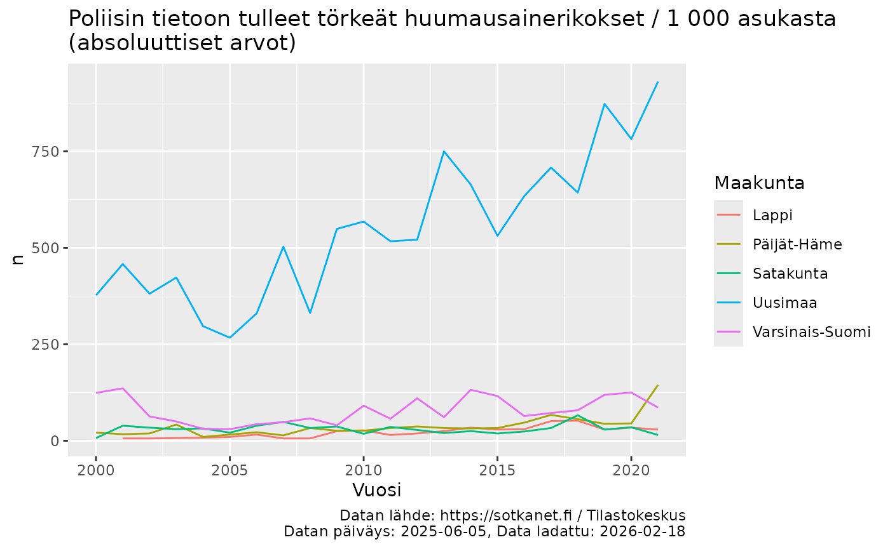
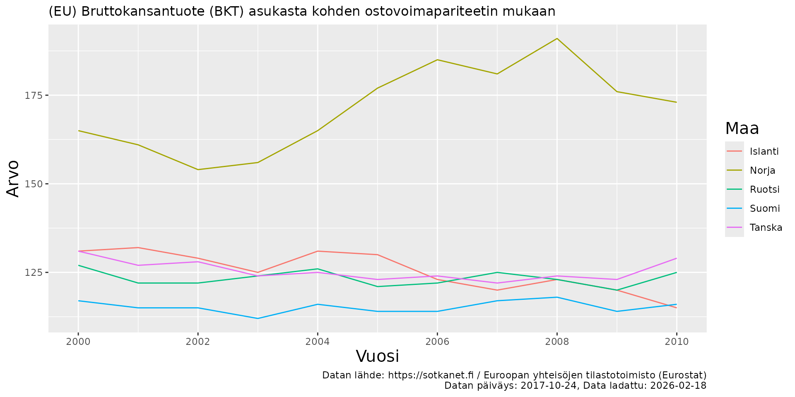
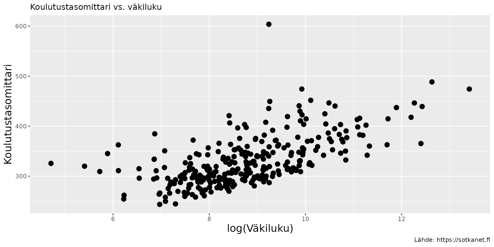
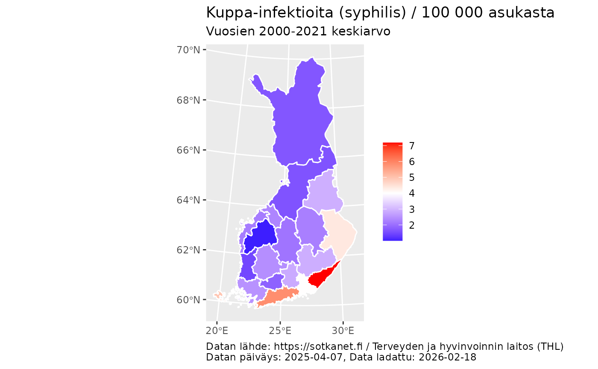

# Sotkanetin avoimen rajapinnan R-työkalut

## Paketin esittely

Sotkanetin avoin rajapinta mahdollistaa pääsyn yli kahteen tuhanteen
väestöindikaattoriin Suomesta ja Euroopasta. Palvelua ylläpitää
Terveyden ja hyvinvoinnin laitos (THL). Lisätietoa
[palvelusta](https://sotkanet.fi/sotkanet/fi/tietoa-palvelusta) ja
kuvaus [avoimesta
rajapinnasta](https://sotkanet.fi/sotkanet/fi/ohje/74).

Tämän `sotkanet` paketin käyttäjät pystyvät hakemaan Sotkanetin dataa
rajapinnasta suoraan R:ään ja hyödyntämään dataa analyyseissa ja
visualisoinneissa. Paketti on kehitetty osana
[rOpenGov](https://ropengov.org)-kehittäjäyhteisöä.

## Paketin asennus

Paketin vakaan, viimeisimmän CRANissa julkaistun version asentaminen on
useimmille käyttäjille suositeltavin vaihtoehto. Paketin uusimman
CRANissa julkaistun version voi asentaa komennolla:

``` r
install.packages("sotkanet")
```

Joissakin tapauksissa voi olla hyödyllistä asentaa paketin vanha versio.
CRAN ylläpitää jokaisesta CRANissa julkaistusta paketista arkistoa,
johon pääsee esimerkiksi [sotkanet-paketin
CRAN-sivulla](https://cran.r-project.org/package=sotkanet) klikkaamalla
Old sources: sotkanet archive -linkkiä.

``` r
install.packages("https://cran.r-project.org/src/contrib/Archive/sotkanet/sotkanet_0.9.76.tar.gz", repos=NULL, type="source")
```

Paketin kehitysversion voi asentaa GitHubista seuraavilla tavoilla:

``` r
library(remotes)
remotes::install_github("ropengov/sotkanet")

# Tietyn git branchin, tässä tapauksessa 'v0.10-dev' -nimisen branchin version asentaminen
remotes::install_github("ropengov/sotkanet@v0.10-dev")

# Tietyn pull requestin, tässä tapauksessa PR 26 "Add check for region.code length" mukaisen version asentaminen
remotes::install_github("ropengov/sotkanet", ref = remotes::github_pull("26"))
remotes::install_github("ropengov/sotkanet#26")
```

`remotes`-paketin käyttäminen vaatii Githubin Personal Access Tokenin
(PAT) määrittelyn. Ohjeita tähän löytyy esimerkiksi `usethis`-paketin
[artikkelista](https://usethis.r-lib.org/articles/git-credentials.html#what-about-the-remotes-and-pak-packages).

Asennuksen onnistumista voi testata lataamalla paketin:

``` r
library(sotkanet)
```

## Paketin käyttö

### Käytettävissä olevat indikaattorit ja aluejaot

Aloitetaan lataamalla tarvittavat paketit:

``` r
library(sotkanet)
library(kableExtra)
library(ggplot2)
```

Käytettävissä olevat indikaattorit voi listata käyttämällä funktiota
[`sotkanet_indicators()`](https://ropengov.github.io/sotkanet/reference/sotkanet_indicators.md):

``` r
# Ladataan muutama esimerkki-indikaattori
indicators <- sotkanet_indicators(id = c(4, 5, 6, 127, 10012, 10027), type = "table")
# Visualisoidaan taulukkomuodossa
kable(indicators)
```

| indicator | indicator.title                                                                                          | indicator.organization | indicator.organization.title                   |
|----------:|:---------------------------------------------------------------------------------------------------------|-----------------------:|:-----------------------------------------------|
|         4 | Mielenterveyden häiriöihin sairaalahoitoa saaneet 0 - 17-vuotiaat / 1 000 vastaavan ikäistä              |                      2 | Terveyden ja hyvinvoinnin laitos (THL)         |
|         5 | Toimeentulotukea saaneet 25 - 64-vuotiaat, % vastaavan ikäisestä väestöstä                               |                      2 | Terveyden ja hyvinvoinnin laitos (THL)         |
|         6 | Somaattisen erikoissairaanhoidon vuodeosastohoitopäivät 75 vuotta täyttäneillä / 1 000 vastaavan ikäistä |                      2 | Terveyden ja hyvinvoinnin laitos (THL)         |
|       127 | Väestö 31.12.                                                                                            |                      3 | Tilastokeskus                                  |
|     10012 | (EU) Bruttokansantuote (BKT) asukasta kohden ostovoimapariteetin mukaan                                  |                     58 | Euroopan yhteisöjen tilastotoimisto (Eurostat) |
|     10027 | (EU) Vakioitu itsemurhakuolleisuus / 100 000 asukasta                                                    |                     58 | Euroopan yhteisöjen tilastotoimisto (Eurostat) |

Kuten listauksesta voidaan huomata, Sotkanet APIsta löytyy THL:n omien
indikaattoreiden lisäksi myös monien muiden viranomaisten, esimerkiksi
Kansaneläkelaitoksen ja Tilastokeskuksen, tuottamia indikaattoreita.
Käyttäjän on syytä olla huolellinen viitatessaan dataan.

Maantieteelliset alueet voi listata käyttämällä funktiota
[`sotkanet_regions()`](https://ropengov.github.io/sotkanet/reference/sotkanet_regions.md):

``` r
# Ladataan kaikki sotkanetin käyttämät alueet
regions <- sotkanet_regions(type = "table")
# Visualisoidaan kuusi ensimmäistä aluetta taulukkomuodossa
kable(head(regions))
```

| region | region.title                    | region.code | region.category     | region.uri                           |
|-------:|:--------------------------------|:------------|:--------------------|:-------------------------------------|
|    833 | Etelä-Suomen AVIn alue          | 1           | ALUEHALLINTOVIRASTO | <http://www.yso.fi/onto/kunnat/ahv1> |
|    834 | Lounais-Suomen AVIn alue        | 2           | ALUEHALLINTOVIRASTO | <http://www.yso.fi/onto/kunnat/ahv2> |
|    835 | Itä-Suomen AVIn alue            | 3           | ALUEHALLINTOVIRASTO | <http://www.yso.fi/onto/kunnat/ahv3> |
|    836 | Länsi- ja Sisä-Suomen AVIn alue | 4           | ALUEHALLINTOVIRASTO | <http://www.yso.fi/onto/kunnat/ahv4> |
|    837 | Pohjois-Suomen AVIn alue        | 5           | ALUEHALLINTOVIRASTO | <http://www.yso.fi/onto/kunnat/ahv5> |
|    838 | Lapin AVIn alue                 | 6           | ALUEHALLINTOVIRASTO | <http://www.yso.fi/onto/kunnat/ahv6> |

### Sotkanet datan lataaminen

Datan lataamiseksi tarvitaan indikaattorin tunniste. Oikean
indikaattorin hakemiseen voi käyttää edellä mainittua
`sotkanet_indicators` funktiota, indikaattorin lataamisessa käytetään
`indicator`-sarakkeesta löytyvää numeerista tunnistetta. Indikaattorin
etsimiseen voi käyttää myös [Sotkanetin
nettisivuja](https://sotkanet.fi/sotkanet/fi/index).

Esimerkiksi indikaattoritunniste 5 vastaa “Toimeentulotukea saaneet 25 -
64-vuotiaat, % vastaavan ikäisestä väestöstä” -datasettiä. Datan voi
ladata käyttämllä
[`get_sotkanet()`](https://ropengov.github.io/sotkanet/reference/get_sotkanet.md)
funktiota. Datasetin hyvinvointialueittaisen datan vuosilta 2000-2010
saa komennolla:

``` r
# Indikaattorin datan hakeminen
dat_5 <- get_sotkanet(indicators = 5, years = 2000:2010,
                    genders = c("total"), region.category = "HYVINVOINTIALUE")

# Datan kuusi ensimmäistä riviä
kable(head(dat_5)) %>%
  kable_styling() %>%
  scroll_box(width = "100%")
```

| indicator | region | year | gender | primary.value | absolute.value | indicator.title                                                            | region.title                       | region.code | region.category | indicator.organization.title           |
|----------:|-------:|-----:|:-------|--------------:|---------------:|:---------------------------------------------------------------------------|:-----------------------------------|:------------|:----------------|:---------------------------------------|
|         5 |    966 | 2003 | total  |           5.8 |           5636 | Toimeentulotukea saaneet 25 - 64-vuotiaat, % vastaavan ikäisestä väestöstä | Keski-Uudenmaan hyvinvointialue    | 02          | HYVINVOINTIALUE | Terveyden ja hyvinvoinnin laitos (THL) |
|         5 |    975 | 2007 | total  |           6.6 |           7434 | Toimeentulotukea saaneet 25 - 64-vuotiaat, % vastaavan ikäisestä väestöstä | Päijät-Hämeen hyvinvointialue      | 09          | HYVINVOINTIALUE | Terveyden ja hyvinvoinnin laitos (THL) |
|         5 |    964 | 2008 | total  |           4.8 |           1674 | Toimeentulotukea saaneet 25 - 64-vuotiaat, % vastaavan ikäisestä väestöstä | Keski-Pohjanmaan hyvinvointialue   | 18          | HYVINVOINTIALUE | Terveyden ja hyvinvoinnin laitos (THL) |
|         5 |    977 | 2002 | total  |           8.7 |          10789 | Toimeentulotukea saaneet 25 - 64-vuotiaat, % vastaavan ikäisestä väestöstä | Vantaan ja Keravan hyvinvointialue | 04          | HYVINVOINTIALUE | Terveyden ja hyvinvoinnin laitos (THL) |
|         5 |    963 | 2010 | total  |           6.1 |           5598 | Toimeentulotukea saaneet 25 - 64-vuotiaat, % vastaavan ikäisestä väestöstä | Kanta-Hämeen hyvinvointialue       | 07          | HYVINVOINTIALUE | Terveyden ja hyvinvoinnin laitos (THL) |
|         5 |    972 | 2005 | total  |           9.1 |           8330 | Toimeentulotukea saaneet 25 - 64-vuotiaat, % vastaavan ikäisestä väestöstä | Pohjois-Karjalan hyvinvointialue   | 14          | HYVINVOINTIALUE | Terveyden ja hyvinvoinnin laitos (THL) |

Sotkanet APIsta löytyy myös monien muiden viranomaisten, esimerkiksi
Kansaneläkelaitoksen ja Tilastokeskuksen, tuottamia indikaattoreita.

``` r
# Indikaattorin datan hakeminen
dat_3090 <- get_sotkanet(indicators = 3090, years = 2000:2021,
                    genders = c("total"), region.category = "MAAKUNTA",
                    regions = c("Uusimaa", "Varsinais-Suomi", "Satakunta", "Päijät-Häme", "Lappi"))

dat_3090_meta <- sotkanet_indicator_metadata(3090)

# Datan kuusi ensimmäistä riviä
kable(head(dat_3090)) %>%
  kable_styling() %>%
  scroll_box(width = "100%")
```

| indicator | region | year | gender | primary.value | absolute.value | indicator.title                                                       | region.title | region.code | region.category | indicator.organization.title |
|----------:|-------:|-----:|:-------|--------------:|---------------:|:----------------------------------------------------------------------|:-------------|:------------|:----------------|:-----------------------------|
|      3090 |    493 | 2005 | total  |           0.1 |             16 | Poliisin tietoon tulleet törkeät huumausainerikokset / 1 000 asukasta | Päijät-Häme  | 07          | MAAKUNTA        | Tilastokeskus                |
|      3090 |    490 | 2012 | total  |           0.1 |             28 | Poliisin tietoon tulleet törkeät huumausainerikokset / 1 000 asukasta | Satakunta    | 04          | MAAKUNTA        | Tilastokeskus                |
|      3090 |    505 | 2021 | total  |           0.2 |             29 | Poliisin tietoon tulleet törkeät huumausainerikokset / 1 000 asukasta | Lappi        | 19          | MAAKUNTA        | Tilastokeskus                |
|      3090 |    490 | 2021 | total  |           0.1 |             15 | Poliisin tietoon tulleet törkeät huumausainerikokset / 1 000 asukasta | Satakunta    | 04          | MAAKUNTA        | Tilastokeskus                |
|      3090 |    488 | 2006 | total  |           0.2 |            330 | Poliisin tietoon tulleet törkeät huumausainerikokset / 1 000 asukasta | Uusimaa      | 01          | MAAKUNTA        | Tilastokeskus                |
|      3090 |    488 | 2020 | total  |           0.5 |            782 | Poliisin tietoon tulleet törkeät huumausainerikokset / 1 000 asukasta | Uusimaa      | 01          | MAAKUNTA        | Tilastokeskus                |

``` r

ggplot(dat_3090, aes(x = year, y = absolute.value, color = region.title)) +
     geom_line() +
     labs(x = "Vuosi", y = "n", title = paste0(dat_3090_meta$title$fi, "\n(absoluuttiset arvot)"), color = "Maakunta",
          caption = paste0(
    "Datan lähde: https://sotkanet.fi / ", dat_3090_meta$organization$title$fi, "\n", "Datan päiväys: ", dat_3090_meta$`data-updated`, ", Data ladattu: ", Sys.Date()))
```

 \###
Datan hakeminen interaktiivisella funktiolla

Datan hakemiseen voi myös käyttää interaktiivista
[`sotkanet_interactive()`](https://ropengov.github.io/sotkanet/reference/sotkanet_interactive.md)
funktiota, joka tarjoaa käyttäjälle interaktiivisen ja helppokäyttöisen
vaihtoehdon datan lataamiselle. Interaktiivisen funktion tarkoituksena
on paitsi helpottaa datan hakemista, myös edistää hyviä käytäntöjä,
kuten datalähteisiin viittaaminen, datan latausskriptin tallentaminen ja
taulukolle lasketun tarkistussumman laskeminen.

Datan interaktiivinen hakeminen näyttää pääpiirteissään
seuraavanlaiselta:

    > sotkanet_interactive()
    Select language 

    1: Finnish
    2: English
    3: Swedish

    Selection: 1
    Enter search id for the data: 3090
    Is this the right dataset? 

    1: Poliisin tietoon tulleet törkeät huumausainerikokset / 1 000 asukasta
    2: No

    Selection: 1
    Download the dataset? 

    1: Yes
    2: No

    Selection: 1
    Would you like to use default arguments or manually select them? 

    1: Default
    2: Manually selected

    Selection: 2
    Enter the beginning year for the data: 2000
    Enter the ending year for the data: 2005
    Which genders do you want for the data? 

    1: Male
    2: Female
    3: Male & Female
    4: Total
    5: All

    Selection: 4
    Print dataset citation? 

    1: Yes
    2: No

    Selection: 1
    Print the code for downloading dataset? 

    1: Yes
    2: No

    Selection: 1
    Print dataset fixity checksum? 

    1: Yes
    2: No

    Selection: 1
    #### DATASET CITATION: 

    @Misc{,
      title = {Poliisin tietoon tulleet törkeät huumausainerikokset / 1 000 asukasta},
      url = {https://sotkanet.fi/sotkanet/fi/metadata/indicators/3090},
      organization = {Tilastokeskus},
      year = {2024},
      urldate = {2024-06-24},
      type = {Dataset},
      note = {Accessed 2024-06-24, dataset last updated 2024-05-22},
    }

    #### DOWNLOAD PARAMETERS: 

    [1] "get_sotkanet(indicators = 3090, years = 2000:2005, genders = c('total'), regions = NULL, region.category = NULL, lang = 'fi')"

    #### FIXITY CHECKSUM: 

    [1] "Fixity checksum (md5) for dataset 3090: 7c13cceb2b63d77685cec243ba3e7a13"

       indicator region year gender primary.value absolute.value                                                       indicator.title
    1       3090    966 2003  total           0.2             41 Poliisin tietoon tulleet törkeät huumausainerikokset / 1 000 asukasta
    2       3090    838 2005  total           0.1             10 Poliisin tietoon tulleet törkeät huumausainerikokset / 1 000 asukasta
    3       3090    611 2004  total           0.0             12 Poliisin tietoon tulleet törkeät huumausainerikokset / 1 000 asukasta
    4       3090    242 2000  total           0.3              5 Poliisin tietoon tulleet törkeät huumausainerikokset / 1 000 asukasta
    5       3090    161 2002  total           0.1             10 Poliisin tietoon tulleet törkeät huumausainerikokset / 1 000 asukasta
    [...]

Tarkempien rajauksien tekeminen indikaattoreihin saattaa johtaa
seuraavanlaiseen varoitusviestiin:

    Warning message:
    In get_sotkanet(indicators = search_id, years = years, genders = gender_selection,  :
      The data.frame is empty

Viesti johtuu usein siitä, että valitussa indikaattorissa ei ole
esimerkiksi dataa valitulta aikaväliltä, tiettyä haluttua aluetta tai
dataa tietyiltä sukupuoliryhmiltä. Varoitusviestin voi välttää
useimmissa tapauksissa lataamalla kaiken datan (‘default arguments’) eli
jättämällä manuaaliset rajaukset tekemättä datan lataamisvaiheessa.
Dataa voi suodattaa lataamisen jälkeen omalla koneella.

## Dataan viittaaminen

Mille tahansa indikaattorille voi tulostaa viitteen käyttämällä
[`sotkanet_cite()`](https://ropengov.github.io/sotkanet/reference/sotkanet_cite.md)
funktiota. Esimerkiksi edellä käytetyn toimeentulotukidatan viitauksen
printtaaminen onnistuu helposti komennolla:

``` r
sotkanet_cite(5)
#> @Misc{,
#>   title = {Toimeentulotukea saaneet 25 - 64-vuotiaat, % vastaavan ikäisestä väestöstä},
#>   url = {https://sotkanet.fi/sotkanet/fi/metadata/indicators/5},
#>   organization = {Terveyden ja hyvinvoinnin laitos (THL)},
#>   year = {2025},
#>   urldate = {2026-02-18},
#>   type = {Dataset},
#>   note = {Accessed 2026-02-18, dataset last updated 2025-05-09},
#> }
```

`sotkanet_cite` funktio mahdollistaa dataviittausten helpon luomisen
muillakin myös muilla rajapinnan tukemilla kielillä:

``` r
sotkanet_cite(5, lang = "sv")
#> @Misc{,
#>   title = {25 - 64-åriga mottagare av utkomststöd, % av befolkningen i samma ålder},
#>   url = {https://sotkanet.fi/sotkanet/sv/metadata/indicators/5},
#>   organization = {Institutet för hälsa och välfärd (THL)},
#>   year = {2025},
#>   urldate = {2026-02-18},
#>   type = {Dataset},
#>   note = {Accessed 2026-02-18, dataset last updated 2025-05-09},
#> }
sotkanet_cite(5, lang = "en")
#> @Misc{,
#>   title = {Social assistance recipients aged 25-64, as % of total population of same age},
#>   url = {https://sotkanet.fi/sotkanet/en/metadata/indicators/5},
#>   organization = {Finnish institute for Health and Welfare (THL)},
#>   year = {2025},
#>   urldate = {2026-02-18},
#>   type = {Dataset},
#>   note = {Accessed 2026-02-18, dataset last updated 2025-05-09},
#> }
```

## Esimerkkejä

Käydään seuraavaksi läpi paketin käyttöä kolmen esimerkin avulla.

### Pohjoismaiden väliset erot

Ensimmäisessä esimerkissä verrataan pohjoismaiden välisiä eroja
Eurostatin tuottamassa BKT-datassa vuosina 2000-2010.

``` r
# Indikaattorin datan hakeminen
dat <- get_sotkanet(indicators = 10012, years = 2000:2010,
                    genders = "total", region.category = "POHJOISMAAT")

indicator_name <- as.character(unique(dat$indicator.title))
indicator_source <- as.character(unique(dat$indicator.organization.title))

# Metadatan hakeminen
dat_meta <- sotkanet_indicator_metadata(10012)

# Visualisointi
library(ggplot2)
p <- ggplot(dat, aes(x = year, y = primary.value,
                     group = region.title, color = region.title)) + 
  geom_line() + ggtitle(paste0(indicator_name)) +
  labs(x = "Vuosi", y = "Arvo", color = "Maa", caption = paste0(
    "Datan lähde: https://sotkanet.fi / ", indicator_source, "\n", "Datan päiväys: ", dat_meta$`data-updated`, ", Data ladattu: ", Sys.Date())) +
  scale_x_continuous(breaks = seq(2000,2010, by = 2)) +
  theme(title = element_text(size = 10)) +
  theme(axis.title.x = element_text(size = 15)) +
  theme(axis.title.y = element_text(size = 15)) +
  theme(legend.title = element_text(size = 15))
print(p)
```



Dataviittaus indikaattorille 10012:

``` r
sotkanet_cite(10012)
#> @Misc{,
#>   title = {(EU) Bruttokansantuote (BKT) asukasta kohden ostovoimapariteetin mukaan},
#>   url = {https://sotkanet.fi/sotkanet/fi/metadata/indicators/10012},
#>   organization = {Euroopan yhteisöjen tilastotoimisto (Eurostat)},
#>   year = {2017},
#>   urldate = {2026-02-18},
#>   type = {Dataset},
#>   note = {Accessed 2026-02-18, dataset last updated 2017-10-24},
#> }
```

### Suomen kuntien väkiluvun yhteys koulutustasomittarin arvoon

Toisessa esimerkissä tarkastellaan Suomen kuntien väkiluvun yhteyttä
kunnan koulutustasomittarin arvoon.

``` r
# Datan hakeminen indikaattoreille
dat <- get_sotkanet(indicators = c(127, 180), 
                    years = 2022, genders = c("total"), region.category = c("KUNTA"))
# Valitaan mielenkiinnon kohteena olevat sarakkeet ja poistetaan päällekkäisyydet
datf <- dat[,c("region.title", "indicator.title", "primary.value")]
datf <- datf[!duplicated(datf),]
dw <- reshape(datf, idvar = "region.title",
              timevar = "indicator.title", direction = "wide")
names(dw) <- c("Municipality", "Population", "Education_level")


# Visualisointi
p <- ggplot(dw, aes(x = log(Population), y = Education_level)) + geom_point(size = 3) +
  ggtitle("Koulutustasomittari vs. väkiluku") +
    theme(title = element_text(size = 10)) +
  labs(x = "log(Väkiluku)", y = "Koulutustasomittari",
       caption = "Lähde: https://sotkanet.fi") +
  theme(axis.title.x = element_text(size = 15)) +
  theme(axis.title.y = element_text(size = 15)) +
  theme(legend.title = element_text(size = 15))
plot(p)
```



Dataviittaukset indikaattoreille 127 ja 180:

``` r
sotkanet_cite(127)
#> @Misc{,
#>   title = {Väestö 31.12.},
#>   url = {https://sotkanet.fi/sotkanet/fi/metadata/indicators/127},
#>   organization = {Tilastokeskus},
#>   year = {2025},
#>   urldate = {2026-02-18},
#>   type = {Dataset},
#>   note = {Accessed 2026-02-18, dataset last updated 2025-04-04},
#> }

sotkanet_cite(180)
#> @Misc{,
#>   title = {Koulutustasomittain},
#>   url = {https://sotkanet.fi/sotkanet/fi/metadata/indicators/180},
#>   organization = {Tilastokeskus},
#>   year = {2025},
#>   urldate = {2026-02-18},
#>   type = {Dataset},
#>   note = {Accessed 2026-02-18, dataset last updated 2025-09-18},
#> }
```

### Infektioiden määrä maakunnittain

Lopuksi demonstroimme sotkanet-datan lataamista ja visualisoimista
kartalle, tässä tapauksessa maakunnittain. Tilastokeskuksen tarjoamien
kartta-aineistojen lataamiseen käytämme toista rOpenGov-pakettia,
`geofi`-pakettia.

Ns. teemakarttojen tapauksessa on hyvä muistaa visualisointitavan
rajoitteet: Pinta-alaltaan suuret ja mahdollisesti harvaan asutut alueet
saattavat ylikorostua kun taas pienet ja tiheästi asutut alueet
saattavat olla vaikeasti tulkittavia. Pidemmän ajan aikasarjojen
visualisointi teemakarttamuodossa on hieman väkinäinen ratkaisu, eikä
alla olevan esimerkin mukainen keskiarvojen laskeminen ole aina
välttämättä kovin mielekästä. Karttavisualisoinneilla on kuitenkin myös
hyvät puolensa, kuten niiden luomisen helppous ja kohtalaisen helppo
tulkittavuus, joten niitä ei tule myöskään väheksyä.

``` r
library(geofi)
#> 
#> geofi R package: tools for open GIS data for Finland.
#> Part of rOpenGov <ropengov.org>.
#> 
#> **************
#> Changes in version 1.1.0:
#> - Object `municipality_central_localities` is depracated and replaced with function `municipality_central_localities()`. More at https://github.com/rOpenGov/geofi/blob/master/NEWS.md
#> - New functions for interacting with both National Land Survey and Statistics Finland OCG API-services. See three new vignettes for examples.
#> **************
library(dplyr)
#> 
#> Attaching package: 'dplyr'
#> The following object is masked from 'package:kableExtra':
#> 
#>     group_rows
#> The following objects are masked from 'package:stats':
#> 
#>     filter, lag
#> The following objects are masked from 'package:base':
#> 
#>     intersect, setdiff, setequal, union
# codes_as_characters = TRUE tarvitaan jotta aluekoodit palautetaan
# tekstimuodossa (esim. "01") eikä kokonaislukuina (esim. 1)
polygon <- geofi::get_municipality_pop(year = 2021, codes_as_character = TRUE)
#> Requesting response from: http://geo.stat.fi/geoserver/wfs?service=WFS&version=1.0.0&request=getFeature&typename=vaestoalue%3Akunta_vaki2021
#> Warning: Coercing CRS to epsg:3067 (ETRS89 / TM35FIN)
#> Data is licensed under: Attribution 4.0 International (CC BY 4.0)

# Yhdistetään kunta-polygonit maakunta-polygoneiksi
regions <- polygon %>% dplyr::group_by(maakunta_name_fi, maakunta_code) %>% 
  dplyr::summarise(vaesto = sum(vaesto))
#> `summarise()` has regrouped the output.
#> ℹ Summaries were computed grouped by maakunta_name_fi and maakunta_code.
#> ℹ Output is grouped by maakunta_name_fi.
#> ℹ Use `summarise(.groups = "drop_last")` to silence this message.
#> ℹ Use `summarise(.by = c(maakunta_name_fi, maakunta_code))` for per-operation
#>   grouping (`?dplyr::dplyr_by`) instead.

# Indikaattorin datan hakeminen
dat_3165 <- get_sotkanet(indicators = 3165, years = 2000:2021,
                    genders = c("total"), region.category = "MAAKUNTA")

# Lasketaan uusi muuttuja, tapausten lukumäärän keskiarvo koko ajanjakson ajalta
dat_3165_mean <- dat_3165 %>%
  dplyr::group_by(region.code) %>%
  dplyr::summarize(mean_cases_per_annum = mean(primary.value))

dat_3165_meta <- sotkanet_indicator_metadata(3165)

regions_and_dat <- dplyr::left_join(regions, dat_3165_mean, by = c("maakunta_code" = "region.code"))

# Teemakartta ggplotilla
ggplot(regions_and_dat) +
  geom_sf(aes(fill = mean_cases_per_annum), color = "white", size = 0.5) + 
  labs(title = dat_3165_meta$title$fi, subtitle = "Vuosien 2000-2021 keskiarvo", color = "", caption = paste0(
    "Datan lähde: https://sotkanet.fi / ", dat_3165_meta$organization$title$fi, "\n", "Datan päiväys: ", dat_3165_meta$`data-updated`, ", Data ladattu: ", Sys.Date())) +
  # theme_void() +
  scale_fill_gradient2(name = "", midpoint = 4, low = "blue", mid = "white", high = "red") +
  theme(plot.caption = element_text(hjust = 0))
#> Ignoring unknown labels:
#> • colour : ""
```



Lähdeviite alkuperäiseen, Sotkanet API:sta ladattuun dataan:

``` r
sotkanet_cite(3165)
#> @Misc{,
#>   title = {Kuppa-infektioita (syphilis) / 100 000 asukasta},
#>   url = {https://sotkanet.fi/sotkanet/fi/metadata/indicators/3165},
#>   organization = {Terveyden ja hyvinvoinnin laitos (THL)},
#>   year = {2025},
#>   urldate = {2026-02-18},
#>   type = {Dataset},
#>   note = {Accessed 2026-02-18, dataset last updated 2025-04-07},
#> }
```

THL:n CC BY 4.0 -lisenssin mukaisesti on myös hyvä mainita, että datan
perusteella laskettiin uusi, tapausten keskiarvoa kuvaava muuttuja
`mean_cases_per_annum`.

## Lisensointi ja viittaminen

### Sotkanetin data

Viittaa Sotkanetiin ja jaa linkki
<https://sotkanet.fi/sotkanet/fi/index>. Muista myös mainita
indikaattorin datan tuottaja (sarakkeesta
`indicator.organization.title`).

- [THL:n avoimen datan lisenssi ja
  vastuuvapauslauseke](https://yhteistyotilat.fi/wiki08/display/THLKA/THL%3An+avoimen+datan+lisenssi+ja+vastuuvapauslauseke).
- [Sotkanet - Tietoa palvelusta - Avoin
  rajapinta](https://sotkanet.fi/sotkanet/fi/ohje/74)
- [Sotkanet - Tietoa palvelusta - Tietojen hyödyntäminen ja
  viittaus](https://sotkanet.fi/sotkanet/fi/ohje/296)

Keskeiset kohdat tiivistettynä:

- “Sotkanet REST API on tarkoitettu tietojen noutamiseen erissä niiden
  jatkokäyttöä varten eri sovelluksissa. Rajapintaa ei ole tarkoitettu
  suoraan, online käyttöön.”
- “THL voi määrittelemänänsä hetkenä käynnistää palvelun uudelleen tai
  sammuttaa sen huoltokatkoa varten. Huoltokatkoista ja muista
  suunnitelluista katkoista pyritään tiedottamaan Sotkanetin kautta.
  Käyttökatkoista ei ilmoiteta suoraan rajapinnan käyttäjille.”
- “Sotkanetin rajapinnan kautta saatavia tietoja saa käyttää vapaasti
  muiden järjestelmien tietopohjana.”
- “Rajapintaa käytetään omalla vastuulla. THL tuottaa rajapinnan
  sellaisenaan ilman takuita. THL pidättää oikeuden rajapinnan
  muutoksiin. THL ei vastaa rajapintaa käyttävien sovellusten
  toiminnasta.”
- THL:n itse tuottamia tilastotietoja ja indikaattoreita koskee THL:n
  oma [avoimen datan lisenssi ja
  vastuuvapauslauseke](https://yhteistyotilat.fi/wiki08/display/THLKA/THL%3An+avoimen+datan+lisenssi+ja+vastuuvapauslauseke).
  Mikäli data on jonkin toisen organisaation, esimerkiksi Eurostatin,
  tuottama, tarkista datan käyttöehdot kyseessä olevan organisaation
  omilta sivuilta.

[Sotkanetin käyttöohjeissa](https://sotkanet.fi/sotkanet/fi/ohje/296)
annetaan seuraavanlainen viittausohje:

    Tilasto- ja indikaattoripankki Sotkanet. Terveyden ja hyvinvoinnin laitos. 0 - 17-vuotiaat lapset, joista on tehty lastensuojeluilmoitus, % vastaavan ikäisestä väestöstä (THL) (ind. 1086). Viitattu 10.6.2023.

    Statistik- och indikatorbanken Sotkanet. Institutet för hälsa och välfärd. Psykiatriska specialiteternas öppenvårdsbesök / 1 000 invånare (ind. 1562). Hänvisning 10.6.2023.

    Sotkanet Indicator Bank. Finnish Institute for Health and Welfare. Outpatient visits in specialities of psychiatry per 1000 inhabitants (ind. 1562). Referenced on 10 June 2023.

Mikäli käytät viittausten hallinnassa bibtexiä ja julkaisun
viittausformaatti vaatii tietynlaista formaattia, yksittäisiin
indikaattoreihin viitatessa suosittelemme käyttämään apuna aiemmin tässä
artikkelissa demonstroitua
[`sotkanet_cite()`](https://ropengov.github.io/sotkanet/reference/sotkanet_cite.md)-funktiota.
Haluamme painottaa datalähteisiin viittaamisen tärkeyttä ja
suosittelemme perehtymään Data-asiain kansalliskomitean julkaisemaan
kansalliseen dataviittausten tiekarttaan ([Finnish Committee for
Research Data, 2018](https://urn.fi/URN:NBN:fi-fe201804106446)), joka
taas käyttää pohjana FORCE11 Joint Declaration of Data Citation
Principlesiä ([Data Citation Synthesis Group,
2014](https://doi.org/10.25490/a97f-egyk)).

### Sotkanet R-paketti

Mikäli käytät julkaisussasi dataa jonka olet hakenut sotkanet-pakettia
käyttäen, toivomme että viittaat pakettiin seuraavalla tavalla:

``` r
citation("sotkanet")
#> Kindly cite the sotkanet R package as follows:
#> 
#>   Leo Lahti, Einari Happonen, Juuso Parkkinen, Joona Lehtomaki, Vesa
#>   Saaristo, Aleksi Lahtinen and Pyry Kantanen (rOpenGov 2024).
#>   sotkanet: Sotkanet Open Data Access and Analysis. R package version
#>   0.10.1 https://github.com/rOpenGov/sotkanet
#> 
#> A BibTeX entry for LaTeX users is
#> 
#>   @Misc{,
#>     title = {sotkanet: Sotkanet Open Data Access and Analysis},
#>     author = {Leo Lahti and Einari Happonen and Joona Lehtomäki and Juuso Parkkinen and Joona Lehtomaki and Vesa Saaristo and Pyry Kantanen and Aleksi Lahtinen},
#>     url = {https://github.com/rOpenGov/sotkanet},
#>     year = {2024},
#>     note = {R package version 0.10.1},
#>   }
#> 
#> Many thanks for all contributors!
```

Tutkimuksessa käytettyihin ohjelmistoihin ja algoritmeihin viittaaminen
ja niiden relevanssin tunnistaminen ja tunnustaminen on toisen
FORCE11-julkaisun, FORCE11 Software Citation Principlesin ([Smith et
al., 2016](https://doi.org/10.7717/peerj-cs.86)), mukaan tärkeää.

## Paketin kehittäminen, vikojen raportointi ja parannusehdotukset

Pakettia voi käyttää, muokata ja levittää vapaasti [kahden ehdon
BSD-lisenssin](https://fi.wikipedia.org/w/index.php?title=BSD-lisenssi&oldid=22409682#Kahden_ehdon_BSD-lisenssi)
ehtojen mukaisesti.

Tunnistetut ja raportoidut bugit, puutteet ja muut rajoitteet on
listattu projektin
[GitHub-issueissa](https://github.com/rOpenGov/sotkanet/issues). Sivulla
voi myös ilmoittaa uusista vioista ja antaa parannusehdotuksia.
Käyttäjien tekemät koodikontribuutiot ovat myös erittäin tervetulleita.

## Istunnon tiedot

Tämä artikkeli luotiin seuraavalla laitteisto- ja
ohjelmistokokoonpanolla:

``` r
sessionInfo()
#> R version 4.5.2 (2025-10-31)
#> Platform: x86_64-pc-linux-gnu
#> Running under: Ubuntu 24.04.3 LTS
#> 
#> Matrix products: default
#> BLAS:   /usr/lib/x86_64-linux-gnu/openblas-pthread/libblas.so.3 
#> LAPACK: /usr/lib/x86_64-linux-gnu/openblas-pthread/libopenblasp-r0.3.26.so;  LAPACK version 3.12.0
#> 
#> locale:
#>  [1] LC_CTYPE=C.UTF-8       LC_NUMERIC=C           LC_TIME=C.UTF-8       
#>  [4] LC_COLLATE=C.UTF-8     LC_MONETARY=C.UTF-8    LC_MESSAGES=C.UTF-8   
#>  [7] LC_PAPER=C.UTF-8       LC_NAME=C              LC_ADDRESS=C          
#> [10] LC_TELEPHONE=C         LC_MEASUREMENT=C.UTF-8 LC_IDENTIFICATION=C   
#> 
#> time zone: UTC
#> tzcode source: system (glibc)
#> 
#> attached base packages:
#> [1] stats     graphics  grDevices utils     datasets  methods   base     
#> 
#> other attached packages:
#> [1] dplyr_1.2.0      geofi_1.1.0      ggplot2_4.0.2    kableExtra_1.4.0
#> [5] sotkanet_0.10.1 
#> 
#> loaded via a namespace (and not attached):
#>  [1] gtable_0.3.6       xfun_0.56          bslib_0.10.0       httr2_1.2.2       
#>  [5] htmlwidgets_1.6.4  tzdb_0.5.0         vctrs_0.7.1        tools_4.5.2       
#>  [9] generics_0.1.4     curl_7.0.0         proxy_0.4-29       tibble_3.3.1      
#> [13] RefManageR_1.4.0   pkgconfig_2.0.3    KernSmooth_2.23-26 RColorBrewer_1.1-3
#> [17] S7_0.2.1           desc_1.4.3         lifecycle_1.0.5    compiler_4.5.2    
#> [21] farver_2.1.2       stringr_1.6.0      textshaping_1.0.4  class_7.3-23      
#> [25] htmltools_0.5.9    sass_0.4.10        yaml_2.3.12        pillar_1.11.1     
#> [29] pkgdown_2.2.0      jquerylib_0.1.4    classInt_0.4-11    cachem_1.1.0      
#> [33] tidyselect_1.2.1   digest_0.6.39      stringi_1.8.7      sf_1.0-24         
#> [37] purrr_1.2.1        labeling_0.4.3     bibtex_0.5.2       fastmap_1.2.0     
#> [41] grid_4.5.2         cli_3.6.5          magrittr_2.0.4     httpcache_1.2.0   
#> [45] e1071_1.7-17       readr_2.1.6        withr_3.0.2        scales_1.4.0      
#> [49] backports_1.5.0    rappdirs_0.3.4     lubridate_1.9.5    timechange_0.4.0  
#> [53] rmarkdown_2.30     httr_1.4.8         ragg_1.5.0         hms_1.1.4         
#> [57] evaluate_1.0.5     knitr_1.51         viridisLite_0.4.3  frictionless_1.2.1
#> [61] rlang_1.1.7        Rcpp_1.1.1         glue_1.8.0         DBI_1.2.3         
#> [65] xml2_1.5.2         svglite_2.2.2      rstudioapi_0.18.0  jsonlite_2.0.0    
#> [69] R6_2.6.1           plyr_1.8.9         units_1.0-0        systemfonts_1.3.1 
#> [73] fs_1.6.6
```
