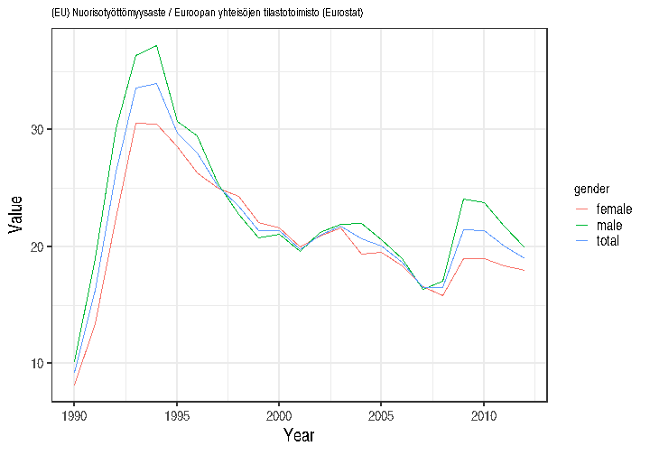
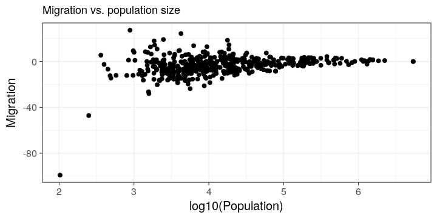

<!--
%\VignetteEngine{knitr}
%\VignetteIndexEntry{sotkanet R vignette}
-->

Sotkanet API R tools
===========

This is the [sotkanet](https://github.com/rOpenGov/sotkanet) R package to access data from the [Sotkanet portal](http://uusi.sotkanet.fi/portal/page/portal/etusivu/hakusivu) that provides over 2000 demographic indicators across Finland and Europe, maintained by the National Institute for Health and Welfare (THL). For more information, see [Sotkanet indicator database](http://uusi.sotkanet.fi/portal/page/portal/etusivu/tietoa_palvelusta) and [API description](http://uusi.sotkanet.fi/portal/pls/portal/!PORTAL.wwpob_page.show?_docname=22001.PDF). This package is part of [rOpenGov](http://ropengov.github.com/).


### Installation

Release version for general users:


```r
install.packages("sotkanet")
library(sotkanet)
```

Development version for developers:


```r
library(devtools)
install_github("ropengov/sotkanet")
```

### Listing available indicators

List available Sotkanet indicators and print as a table:


```r
library(sotkanet) 
sotkanet.indicators <- SotkanetIndicators(type = "table")

library(knitr)
kable(head(sotkanet.indicators))
```


| indicator|indicator.title.fi                                                                           | indicator.organization|indicator.organization.title.fi        |
|---------:|:--------------------------------------------------------------------------------------------|----------------------:|:--------------------------------------|
|         4|Mielenterveyden häiriöihin sairaalahoitoa saaneet 0 - 17-vuotiaat / 1 000 vastaavanikäistä   |                      2|Terveyden ja hyvinvoinnin laitos (THL) |
|         5|Toimeentulotukea saaneet 25 - 64-vuotiaat, % vastaavanikäisestä väestöstä                    |                      2|Terveyden ja hyvinvoinnin laitos (THL) |
|         6|Somaattisen erikoissairaanhoidon hoitopäivät 75 vuotta täyttäneillä / 1 000 vastaavanikäistä |                      2|Terveyden ja hyvinvoinnin laitos (THL) |
|         7|0 - 6-vuotiaat, % väestöstä                                                                  |                      3|Tilastokeskus                          |
|        74|Yksinhuoltajaperheet, % lapsiperheistä                                                       |                      3|Tilastokeskus                          |
|       127|Väestö 31.12.                                                                                |                      3|Tilastokeskus                          |

List geographical regions with available indicators:


```r
sotkanet.regions <- SotkanetRegions(type = "table")
kable(head(sotkanet.regions))
```


| region|region.title.fi                 |region.code |region.category     |region.uri                         |
|------:|:-------------------------------|:-----------|:-------------------|:----------------------------------|
|    833|Etelä-Suomen AVIn alue          |1           |ALUEHALLINTOVIRASTO |http://www.yso.fi/onto/kunnat/ahv1 |
|    834|Lounais-Suomen AVIn alue        |2           |ALUEHALLINTOVIRASTO |http://www.yso.fi/onto/kunnat/ahv2 |
|    835|Itä-Suomen AVIn alue            |3           |ALUEHALLINTOVIRASTO |http://www.yso.fi/onto/kunnat/ahv3 |
|    836|Länsi- ja Sisä-Suomen AVIn alue |4           |ALUEHALLINTOVIRASTO |http://www.yso.fi/onto/kunnat/ahv4 |
|    837|Pohjois-Suomen AVIn alue        |5           |ALUEHALLINTOVIRASTO |http://www.yso.fi/onto/kunnat/ahv5 |
|    838|Lapin AVIn alue                 |6           |ALUEHALLINTOVIRASTO |http://www.yso.fi/onto/kunnat/ahv6 |


### Querying SOTKAnet indicators

Get the [indicator 10013](http://uusi.sotkanet.fi/portal/page/portal/etusivu/hakusivu/metadata?type=I&indicator=10013) from Finland (Suomi) for 1990-2012 (Eurostat employment statistics youth unemployment), and plot a graph:


```r
# Get indicator data
dat <- GetDataSotkanet(indicators = 10013, years = 1990:2012, 
       		       genders = c('female', 'male', 'total'), 
		       region.category = "EUROOPPA", regions = "Suomi")

# Investigate the first lines in the data
kable(head(dat))
```


|           | region|region.title.fi |region.code |region.category | indicator|indicator.title.fi         | year|gender | primary.value| absolute.value|indicator.organization.title.fi                |
|:----------|------:|:---------------|:-----------|:---------------|---------:|:--------------------------|----:|:------|-------------:|--------------:|:----------------------------------------------|
|10013.1139 |   1022|Suomi           |246         |EUROOPPA        |     10013|(EU) Nuorisotyöttömyysaste | 1991|total  |          16.3|             NA|Euroopan yhteisöjen tilastotoimisto (Eurostat) |
|10013.1140 |   1022|Suomi           |246         |EUROOPPA        |     10013|(EU) Nuorisotyöttömyysaste | 2010|male   |          23.8|             NA|Euroopan yhteisöjen tilastotoimisto (Eurostat) |
|10013.1141 |   1022|Suomi           |246         |EUROOPPA        |     10013|(EU) Nuorisotyöttömyysaste | 1996|male   |          29.5|             NA|Euroopan yhteisöjen tilastotoimisto (Eurostat) |
|10013.1142 |   1022|Suomi           |246         |EUROOPPA        |     10013|(EU) Nuorisotyöttömyysaste | 2000|total  |          21.4|             NA|Euroopan yhteisöjen tilastotoimisto (Eurostat) |
|10013.1143 |   1022|Suomi           |246         |EUROOPPA        |     10013|(EU) Nuorisotyöttömyysaste | 1995|total  |          29.7|             NA|Euroopan yhteisöjen tilastotoimisto (Eurostat) |
|10013.1144 |   1022|Suomi           |246         |EUROOPPA        |     10013|(EU) Nuorisotyöttömyysaste | 1998|male   |          22.8|             NA|Euroopan yhteisöjen tilastotoimisto (Eurostat) |

### Fetch all SOTKAnet indicators

This takes for a long time and is not recommended for regular
use. Save the data on your local disk for further work.


```r
# These indicators have problems with R routines:
probematic.indicators <- c(1575, 1743, 1826, 1861, 1882, 1924, 1952, 2000, 2001, 2033, 2050, 3386, 3443)

# Get data for all indicators
datlist <- list()
for (ind in setdiff(sotkanet.indicators$indicator, probematic.indicators)) {
  datlist[[as.character(ind)]] <- GetDataSotkanet(indicators = ind, 
  		years = 1990:2013, genders = c('female', 'male', 'total'))
}

# Combine tables (this may require considerable time and memory 
# for the full data set)
dat <- do.call("rbind", datlist)
```

## Visualization

Download and visualize time series:


```r
# Pick indicator name
indicator.name <- as.character(unique(dat$indicator.title.fi))
indicator.source <- as.character(unique(dat$indicator.organization.title.fi))

# Visualize
library(ggplot2)
theme_set(theme_bw(20)); 
p <- ggplot(dat, aes(x = year, y = primary.value, group = gender, color = gender)) 
p <- p + geom_line() + ggtitle(paste(indicator.name, indicator.source, sep = " / ")) 
p <- p + xlab("Year") + ylab("Value") 
p <- p + theme(title = element_text(size = 10))
p <- p + theme(axis.title.x = element_text(size = 20))
p <- p + theme(axis.title.y = element_text(size = 20))
p <- p + theme(legend.title = element_text(size = 15))
print(p)
```

 


Investigate the effect of municipality size on demographic
variation. Smaller municipalities show more random variation as
expected by statistical arguments:


```r
selected.inds <- c(127, 178)
dat <- GetDataSotkanet(indicators = selected.inds, 
       			years = 2011, genders = c('total'))
# Pick necessary fields and remove duplicates
datf <- dat[, c("region.title.fi", "indicator.title.fi", "primary.value")]
datf <- datf[!duplicated(datf),]
dw <- reshape(datf, idvar = "region.title.fi", 
      		    timevar = "indicator.title.fi", direction = "wide")
names(dw) <- c("Municipality", "Population", "Migration")
p <- ggplot(dw, aes(x = log10(Population), y = Migration)) 
p <- p + geom_point(size = 3)
p <- p + ggtitle("Migration vs. population size") 
p <- p + theme(title = element_text(size = 15))
p <- p + theme(axis.title.x = element_text(size = 20))
p <- p + theme(axis.title.y = element_text(size = 20))
p <- p + theme(legend.title = element_text(size = 15))
print(p)
```

 


For further usage examples, see
[Louhos-blog](http://louhos.wordpress.com), and
[takomo](https://github.com/louhos/takomo/tree/master/Sotkanet).


# Licensing and Citations

### SOTKAnet data

Cite SOTKAnet and link to [http://www.sotkanet.fi](http://www.sotkanet.fi/). Also mention indicator provider. 

 * [Full license and terms of use](http://uusi.sotkanet.fi/portal/page/portal/etusivu/tietoa_palvelusta). 

Central points:

 * SOTKAnet REST API is meant for non-regular data queries. Avoid regular and repeated downloads.
 * SOTKAnet API can be used as the basis for other systems
 * Metadata for regions and indicators are under [CC-BY 3.0](http://creativecommons.org/licenses/by/3.0/) 
 * THL indicators are under [CC-BY 3.0](http://creativecommons.org/licenses/by/3.0/) 
 * Indicators provided by third parties can be used only by separate agreement!


### SOTKAnet R package

This work can be freely used, modified and distributed under the 
[Two-clause BSD license](http://en.wikipedia.org/wiki/BSD\_licenses).


```r
citation("sotkanet")
```

```
## 
## Kindly cite the sotkanet R package as follows:
## 
##   (C) Leo Lahti, Einari Happonen, Juuso Parkkinen and Joona
##   Lehtomaki 2013-2015. sotkanet: Sotkanet R Tools
## 
## A BibTeX entry for LaTeX users is
## 
##   @Misc{,
##     title = {sotkanet R package},
##     author = {Leo Lahti and Einari Happonen and Juuso Parkkinen and Joona Lehtomaki},
##     year = {2013},
##   }
## 
## For more info, see: https://github.com/ropengov/sotkanet/
```

### Session info

This vignette was created with


```r
sessionInfo()
```

```
## R version 3.2.1 (2015-06-18)
## Platform: x86_64-unknown-linux-gnu (64-bit)
## Running under: Ubuntu 15.04
## 
## locale:
##  [1] LC_CTYPE=en_US.UTF-8       LC_NUMERIC=C              
##  [3] LC_TIME=en_US.UTF-8        LC_COLLATE=en_US.UTF-8    
##  [5] LC_MONETARY=en_US.UTF-8    LC_MESSAGES=en_US.UTF-8   
##  [7] LC_PAPER=en_US.UTF-8       LC_NAME=C                 
##  [9] LC_ADDRESS=C               LC_TELEPHONE=C            
## [11] LC_MEASUREMENT=en_US.UTF-8 LC_IDENTIFICATION=C       
## 
## attached base packages:
## [1] stats     graphics  grDevices utils     datasets  methods   base     
## 
## other attached packages:
## [1] ggplot2_1.0.1      sotkanet_0.9.13    RCurl_1.95-4.6    
## [4] bitops_1.0-6       knitr_1.10.5       scimapClient_0.2.1
## 
## loaded via a namespace (and not attached):
##  [1] Rcpp_0.11.6      digest_0.6.8     MASS_7.3-41      plyr_1.8.3      
##  [5] grid_3.2.1       gtable_0.1.2     formatR_1.2      magrittr_1.5    
##  [9] scales_0.2.5     evaluate_0.7     highr_0.5        stringi_0.5-2   
## [13] reshape2_1.4.1   labeling_0.3     proto_0.3-10     rjson_0.2.15    
## [17] RJSONIO_1.3-0    tools_3.2.1      stringr_1.0.0    munsell_0.4.2   
## [21] colorspace_1.2-6
```
